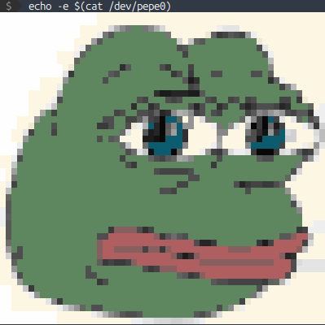

## pepe-drive

Toy project. A simple Linux driver for in-memory char device. Allow read ANSI image from `/dev/pepe0`. Probably not secure, so use it on your own risk.

<p align="center">

</p>

```bash
# Load module (driver)
$ make
$ sudo ./manage_module.bash load
$ ls -al /dev/pepe0
  cr--r--r-- 1 root root 509, 0 maj  2 09:51 /dev/pepe0

# Read device content
$ echo -e $(cat /dev/pepe0)
$ sudo dmesg | tail -20

# Check module parameter
$ cat /sys/module/pepe/parameters/wednesday

# Unload module (driver)
$ sudo ./manage_module.bash unload
```

### Visual Studio Code and clangd

After generating `compile_commands.json` for Linux source code, clangd extension can be used.
```bash
$ cd ~/linux-kernel
$ ./scripts/clang-tools/gen_compile_commands.py

$ cp ~/linux-kernel/compile_commands.json ~/pepe-drive
```

Then reset Visual Studio Code.

### clang-format

```bash
$ ln -s ~/linux-kernel/.clang-format .

$ clang-format -style=file:.clang-format -i *.c
$ clang-format -style=file:.clang-format -i *.h
```

### See also/References/Credits

* https://lwn.net/Kernel/LDD3/
* https://github.com/d0u9/Linux-Device-Driver
* https://dom111.github.io/image-to-ansi/
